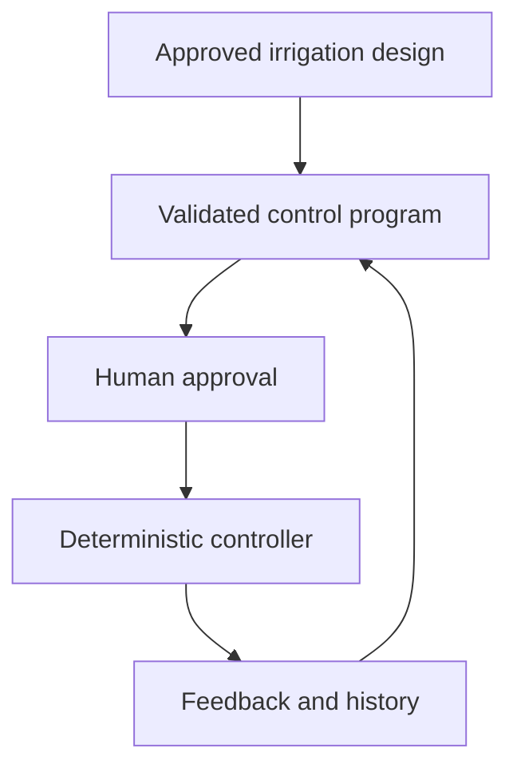

# Automation and Control

This file defines how an approved irrigation design becomes a safe, testable operating program. It is part of the Sprinkler and Landscape Engineer/Designer AI Agent specification. Root instructions are in [CLAUDE.md](../CLAUDE.md).

The design agent and the physical controller have different jobs:

- The AI agent gathers project information, performs engineering calculations, proposes schedules, explains decisions and generates configuration.
- Deterministic software validates and executes the approved configuration.
- Hardware protections and required licensed work remain independent of the AI and home-automation layer.

## 1. Design-to-operation boundary

Use this workflow:

Do not allow free-form model output to operate a physical valve, master valve or pump directly. Convert recommendations to a validated configuration first.

Every deployable configuration must identify:

- Project and jurisdiction
- Design revision
- Source data revision
- Controller and zone identifiers
- Hydraulic design flow and pressure
- Approved runtime limits
- Watering restrictions
- Required sensors and safety devices
- Human approver
- Deployment date and configuration version

## 2. Control-domain model

### System

The system contains one or more controllers and shared rules.

Recommended fields:

- `system_id`
- `name`
- `timezone`
- `location`
- `units`
- `controllers`
- `watering_restrictions`
- `weather_adjustment_policy`
- `global_safety_limits`
- `configuration_version`

### Controller

A controller manages zones and sequences that share a point of connection, master valve, pump or operating policy.

Recommended fields:

- `controller_id`
- `name`
- `enabled`
- `master_valve`
- `pump_start`
- `lead_time_seconds`
- `lag_time_seconds`
- `maximum_simultaneous_flow`
- `maximum_simultaneous_zones`
- `manual_run_policy`
- `zones`
- `sequences`

### Zone

A zone represents physical irrigation equipment operated together by one valve or controlled output.

Recommended fields:

- `zone_id`
- `name`
- `hydrozone_id`
- `actuator_id`
- `irrigation_method`
- `design_flow`
- `required_operating_pressure`
- `expected_flow_minimum`
- `expected_flow_maximum`
- `base_runtime`
- `minimum_runtime`
- `maximum_runtime`
- `maximum_continuous_runtime`
- `minimum_off_time`
- `allow_manual`
- `schedules`
- `sensors`
- `safety_policy`

### Schedule

A schedule describes when an approved zone or sequence may run.

Recommended fields:

- `schedule_id`
- `name`
- `enabled`
- `target_id`
- `anchor`: `start` or `finish`
- `time`, sunrise/sunset rule or validated cron rule
- `base_duration`
- `weekday_filter`
- `day_filter`
- `month_filter`
- `date_range`
- `watering_window`
- `restriction_rule`
- `weather_adjustment_policy`

### Sequence

A sequence is an ordered list of zone steps.

Recommended fields:

- `sequence_id`
- `name`
- `enabled`
- `steps`
- `repeat_count`
- `default_delay`
- `maximum_total_runtime`
- `maximum_total_volume`
- `schedules`

Each step should contain zone ID, approved duration, optional volume limit, delay, repeat count and enabled status. A zone may appear more than once to support cycle-and-soak.

## 3. Schedule rules

Support:

- Fixed local time
- Start or finish anchor
- Sunrise or sunset with a bounded offset
- Weekday selection
- Day-of-month selection
- Odd or even calendar days when legal
- Every-N-days intervals with an explicit starting date
- Month selection
- Inclusive from/until date ranges
- Local watering-day and time-window restrictions
- Temporary rain, maintenance or emergency suspension

Scheduling must use the project timezone and handle:

- Daylight-saving changes
- Leap years
- Month and year boundaries
- Sunrise and sunset changes
- Power or software restart
- Schedule changes after the run queue has been created
- Overlapping schedules
- A finish-anchored run that no longer fits in the allowed window

Precedence should be explicit:

1. Emergency shutdown
2. Hard safety limits
3. Legal and utility restrictions
4. Maintenance or rain suspension
5. Manual override policy
6. Approved schedule
7. Weather or soil runtime adjustment

Lower-priority logic must never override higher-priority protection.

## 4. Sequence and cycle-and-soak logic

Use sequences when available flow or pressure does not permit all zones to run together.

Support:

- Ordered zone steps
- One zone at a time by default
- Verified multi-zone operation only when combined flow and hydraulics pass
- Individual zone durations
- Inter-zone delay
- Repeats
- Disabled steps
- Proportional adjustment of sequence runtimes
- Maximum sequence runtime
- Maximum sequence volume

Cycle-and-soak should divide the required runtime into shorter applications separated by infiltration time. The calculation engine, not an arbitrary default, should determine the starting cycle length from precipitation/application rate, soil intake, slope and runoff observation.

## 5. Runtime adjustment

Store the approved base runtime separately from the current adjusted runtime.

A new adjustment must always apply to the approved base runtime. Do not compound daily adjustments unless the method explicitly requires it.

Support:

- Replace with an actual duration
- Percentage of base duration
- Increase or decrease by a duration
- Reset to base duration
- Zone-level adjustment
- Sequence-level proportional adjustment

Apply limits in this order:

1. Calculate the scientific or approved adjustment.
2. Clamp to configured minimum and maximum runtime.
3. Apply maximum continuous runtime.
4. Split into cycle-and-soak if required.
5. Verify that the adjusted program fits the legal watering window.
6. Recalculate expected volume.
7. Record the reason, source data and calculation version.

Weather adjustment should use accepted evapotranspiration, rainfall, soil and plant methods. Personal threshold examples may be used only as UI demonstrations or explicitly labeled experiments.

If weather or soil data is missing, stale, out of range or internally inconsistent, use the documented safe fallback. Never interpret a failed sensor as proof that watering is unnecessary.

## 6. Master valve and pump sequencing

Define the allowed operating sequence for each system.

A typical sequence may be:

1. Confirm controller and safety status.
2. Confirm expected initial no-flow state.
3. Open the master valve or start the pump according to approved equipment logic.
4. Wait the verified lead time.
5. Open the zone valve.
6. Confirm actuator state and water flow.
7. Operate within pressure, flow, runtime and volume limits.
8. Transition to the next zone using the approved overlap or delay.
9. Close the final zone.
10. Stop the pump or close the master valve using the approved lag time.
11. Confirm final no-flow state.

Never operate a pump against a closed discharge unless the pump system is specifically designed for it. Never overlap zones unless combined flow, pressure and pipe velocity have been verified.

Negative lead, lag or inter-zone values require equipment-specific hydraulic review. Do not use them merely because another controller supports them.

## 7. Three-state feedback model

Track these states separately:

1. **Commanded state:** what the software requested.
2. **Actuator-reported state:** what the controller, relay or valve device reports.
3. **Flow-confirmed state:** whether measured water behavior agrees with the command.

Examples:

| Command | Device report | Flow | Interpretation |
|---|---|---|---|
| Off | Off | Zero | Normal off state |
| On | On | Expected | Normal irrigation |
| On | On | Zero or low | Closed supply, failed valve, blockage, pump failure or bad sensor |
| On | Off | Zero | Command or actuator failure |
| Off | Off | Positive | Leak, stuck valve, meter error or untracked water use |
| On | On | Excessive | Broken pipe, missing device, wrong zone or sensor error |

Do not claim successful irrigation from a switch state alone.

## 8. Flow and volume monitoring

For each zone, store:

- Engineered design flow
- Learned normal-flow range
- Minimum expected flow
- Maximum expected flow
- Maximum allowed run volume
- Sensor model, units and calibration data
- Sensor freshness and confidence

Use cumulative meter readings when available. Calculate run volume from the difference between start and finish readings. Derive average flow only when timing and meter resolution support it.

Support these fault classes:

- No flow after valve opening
- Low flow
- High flow
- Flow when all zones are off
- Sensor value moving backward unexpectedly
- Stale sensor
- Physically impossible rate of change
- Run-volume limit exceeded
- Runtime limit exceeded

Allow a short configurable stabilization period after a valve transition before evaluating normal flow. Limits must be specific to each zone where possible.

## 9. Fault response

Every fault policy must define detection, delay, retries, shutdown action, notification, reset conditions and required inspection.

| Fault | Default response |
|---|---|
| Actuator does not reach commanded state | Stop affected run, retry only if allowed, notify |
| No flow with valve commanded on | Stop zone and pump safely, record fault, notify |
| Excessive flow | Emergency stop, close master valve when appropriate, notify immediately |
| Flow with all valves off | Close master valve when safe, disable automatic runs, notify |
| Sensor missing or stale | Use documented fallback or block automatic run according to risk |
| Controller restart during a run | Restore state cautiously, verify physical system, default to safe off when uncertain |
| Maximum runtime or volume reached | Stop run and flag inspection |
| Repeated communication failure | Stop retries, enter fault state, require review |

Do not retry indefinitely. A device that repeatedly fails to follow commands must enter a latched fault state until the configured reset condition is met.

## 10. Operating states

Use an explicit state machine. Recommended states:

- `idle`
- `scheduled`
- `starting`
- `running`
- `soaking`
- `paused`
- `suspended`
- `stopping`
- `completed`
- `cancelled`
- `faulted`

Every transition should identify:

- Triggering command or event
- Previous and next state
- Timestamp
- User or automation source
- Relevant sensor readings
- Reason
- Configuration version

Reject invalid transitions instead of attempting to guess intent.

## 11. Manual operations

Support:

- Manual run with a bounded duration
- Manual run queue
- Immediate manual run only when explicitly allowed
- Pause and resume
- Temporary suspension for a duration or until a timestamp
- Cancel current run
- Enable or disable controller, zone, sequence or schedule

Manual operation must still obey hard safety limits. Decide explicitly whether it may bypass ordinary schedules, watering restrictions, weather holds or disabled status.

Provide a local physical shutoff method independent of the app.

## 12. Events and history

Emit structured events for:

- Program scheduled
- Program adjusted
- Sequence started, paused, resumed, cancelled and completed
- Zone commanded on and off
- Actuator state confirmed or mismatched
- Flow confirmed
- Volume or flow fault
- Sensor stale or unavailable
- Master valve or pump transition
- Configuration change
- Emergency shutdown

Store at least:

- Project, controller, sequence and zone IDs
- Schedule ID or manual-run indicator
- Planned and actual start
- Base and adjusted duration
- Adjustment type, value and reason
- Actual runtime
- Estimated and measured volume
- Average and peak flow when reliable
- Relevant weather and soil readings
- Commanded, reported and flow-confirmed states
- Completion or fault status
- Configuration and calculation versions

History should support daily, weekly, monthly and seasonal water-use reports.

## 13. Restart and offline behavior

Define behavior for:

- Power loss
- Software restart
- Network loss
- Home Assistant restart
- Controller restart
- Sensor outage
- Clock or timezone change

On restart, do not assume a prior command is still active. Compare stored state, physical actuator state and current flow. When the actual condition cannot be established, move to the safest equipment-specific state and notify the owner.

Local hardware should enforce maximum valve-on time and safe pump shutdown where practical. Cloud or Wi-Fi failure must not leave unlimited irrigation running.

## 14. Optional Home Assistant integration

Home Assistant may provide:

- Configuration and dashboards
- Manual controls
- Schedule display
- Weather and soil data
- Notifications
- History
- Connection to supported valve hardware

Keep it as an adapter under `integrations/home_assistant/`. The core schedule, safety, flow and event models should not depend on Home Assistant-specific entity names.

Generated Home Assistant configurations must be marked as drafts until entity IDs, hardware behavior, time zone, fail-safe behavior and safety limits are verified.

## 15. Required tests

Create deterministic tests for:

- Fixed-time schedules
- Sunrise and sunset schedules
- Start and finish anchors
- Weekdays, odd/even days and every-N-days
- Seasonal date ranges
- Daylight-saving transitions
- Leap year and month-end behavior
- Overlapping schedules
- Zone sequencing and repeats
- Cycle-and-soak
- Minimum and maximum runtime
- Weather adjustment limits
- Missing or stale weather data
- Pause, resume, suspend and cancel
- Queued and immediate manual runs
- Master-valve and pump lead/lag
- Valve overlap and hydraulic-flow rejection
- Actuator check-back and bounded retry
- Low, high, zero and unexpected flow
- Run-volume limit
- Restart during each operating state
- Corrupt or incompatible saved state
- Local restriction changes

Use a virtual clock so years of schedules can be tested quickly. Assertions should verify the exact order and time of commands, transitions and faults.

## 16. Acceptance criteria

The automation module is acceptable only when it can:

- Convert an approved zone schedule into a validated controller program.
- Reject programs that exceed hydraulic, runtime, volume or concurrency limits.
- Keep the approved base runtime separate from adjustments.
- Execute cycle-and-soak correctly.
- Respect watering restrictions and suspensions.
- Confirm operation using command, device and flow states.
- Shut down predictably for configured faults.
- Recover safely from restart and communication loss.
- Produce complete event and water-use history.
- Pass virtual-time and fault-injection tests.
- Generate optional Home Assistant output without coupling core logic to Home Assistant.

## 17. External reference

The control concepts above were informed in part by the open-source Irrigation Unlimited project:

- Repository: https://github.com/rgc99/irrigation_unlimited
- Local review: [Irrigation Unlimited review](../knowledge/external-projects/irrigation-unlimited.md)
- License: MIT

Do not use it as a source for hydraulic, landscape, electrical-code or local regulatory decisions.
